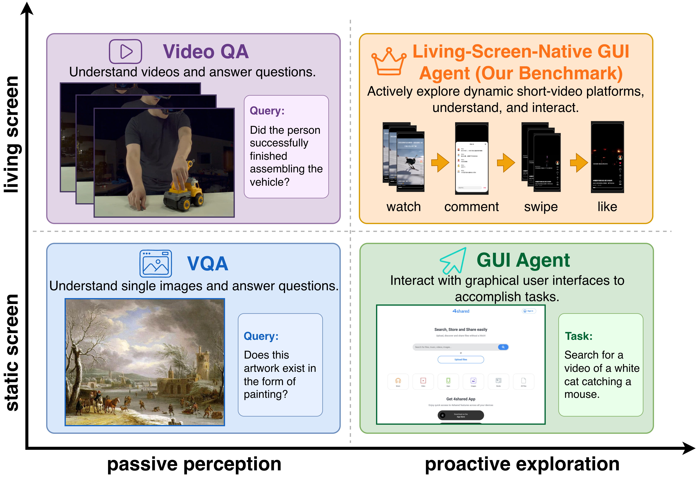
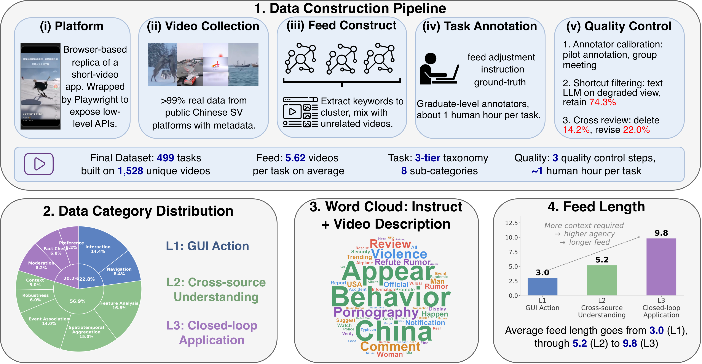

# LivingScreen

**短视频平台上的 Living-Screen-Native GUI 智能体评测基准**

[📄 论文](https://arxiv.org/html/2606.04701v1) · [💻 代码与数据](https://github.com/BITHLP/LivingScreen) · [English](README.md) | **简体中文**

---

当前的 GUI 智能体都默认面对一块**静态屏幕**——在两次动作之间，世界是静止的。但短视频等真实界面打破了这一假设：内容会持续播放，一个合格的用户必须主动决定**看什么、看多久**。我们将其形式化为 **Living-Screen-Native GUI 智能体**，并发布 **LivingScreen**——首个在短视频平台上实现该设定的评测基准。

<p align="center"></p>
<p align="center"><em>Living-screen-native 智能体（右上象限）处在唯一同时具备「环境自主演化」与「智能体原生操作」的象限——短视频平台天然属于这一象限，却被现有基准忽视。</em></p>

## 核心亮点

- **全新设定**：living-screen-native 智能体在**连续时间**演化的屏幕上工作，并主动决定**观察哪一段视觉切片**——使信息获取成为一项内生的、有成本的决策，而非固定的数据喂入。
- **高保真环境**：现代短视频 App 的浏览器复刻，通过 **Playwright** 动作 API 暴露给智能体。智能体只能看到渲染后的截图 / 录屏，无法访问 DOM 或原始视频文件。
- **三层任务体系**：**L1** 原子 GUI 操作 → **L2** 跨源理解 → **L3** 闭环应用。
- **双轴指标**：同时衡量**准确率**与**信息效率**。
- **499 个任务**，覆盖 **1,528 个独立视频**，平均每个任务 **5.62 个视频**。

<p align="center"></p>

## 任务与指标

| 层级 | 考察内容 | 子类别 |
|------|---------|--------|
| **L1 — GUI 操作** | 基础 GUI 原语 | 交互（点赞 / 收藏 / 评论 / 举报）、导航（滑动 / 进度条跳转） |
| **L2 — 跨源理解** | 整合 feed 内多源证据 | 上下文关联、事件关联、特征分析、时空聚合、鲁棒性评估 |
| **L3 — 闭环应用** | 浏览 → 决策 → 操作的闭环 | 事实核查、内容审核、偏好模拟 |

| 指标 | 含义 | 目标 |
|------|------|------|
| **SR** 成功率 | 任务准确率（L1/L3 由环境后端判定，L2 为选项匹配） | ↑ |
| **NS** 步数 | 每个 episode 的工具调用次数（*操作*成本） | ↓ |
| **WR** 观看比例 | 通过 `watch` 录制的内容占 feed 总时长的比例（*观察*成本） | ↓ |

## 主要发现

- **对前沿模型极具挑战**：没有任何受测 MLLM 达到人类的成本-准确率前沿。
- **过度观察与观察不足**：最主要的失败模式——模型系统性地看得远多于或远少于任务所需，是推理中「过度/不足思考」在视觉通道上的对应物。人类会先低成本「扫一眼」再决定是否深看，而模型缺少这一侦察步骤。
- **是能力缺口，而非意识问题**：提示词干预只能改变行为，却无法提升 SR——观察控制是一项真实的能力短板。

这将**观察控制**确立为 GUI 智能体能力的一个全新维度，与动作定位、内容理解并列。

## 运行

<!-- WIP -->

## 引用

```bibtex
@article{livingscreen2026,
  title   = {Benchmarking Living-Screen-Native GUI Agents on Short-Video Platforms},
  journal = {arXiv preprint arXiv:2606.04701},
  year    = {2026}
}
```
